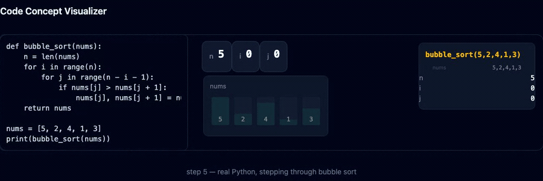

# Code Concept Visualizer

Write Python, watch it run — step by step, as an animation you control.

**[Try it live →](https://code-concept-visualizer.netlify.app/)**



Beginners learn control structures by reading static code, which never builds intuition for what
happens at runtime. This tool takes Python **you** write, executes it in the browser with real
CPython (Pyodide, compiled to WebAssembly), and turns the execution into a step-controllable,
gamified animation — without anyone having hand-scripted an animation for that specific example.

> **Status: v1 complete — all 15 milestones built.** The full spec, every acceptance criterion,
> and the record of what the build taught us are in [`docs/PLAN_v2.md`](docs/PLAN_v2.md).

## What it does

- **Runs your own Python.** A [supported subset](docs/SUBSET.md) — loops, conditionals, functions,
  recursion, lists, dicts, strings — checked before anything executes, so a mistake gets a plain
  message naming the construct and the line, never a raw traceback.
- **Animates the execution, not a script of it.** The picture is derived from a real trace of a
  real run. Change the code, get a different animation, with nothing hand-authored per example.
- **Puts you in control of time.** Play, pause, step forward, step back, scrub, change speed. Step
  backward from the middle and the picture matches what you saw on the way forward.
- **11 lessons**, each animating the moment you open it — before Python has finished loading.
- **A game layer**: predict what happens next (Challenge), reassemble a shuffled program
  (Practice), fill in a flowchart derived from the code itself, and compare two algorithms
  step-locked side by side.
- **Survives Python failing to load entirely.** Every lesson still animates from its shipped
  recording; only "run your own code" goes away, and it says so.

## Running it locally

```bash
npm install
npm run dev
```

| Command                | Does                                                  |
| ---------------------- | ----------------------------------------------------- |
| `npm run dev`          | dev server with hot reload                            |
| `npm test`             | test suite, single run                                |
| `npm run test:watch`   | test suite, watching                                  |
| `npm run typecheck`    | TypeScript, no emit                                   |
| `npm run format`       | Prettier, writes in place                             |
| `npm run format:check` | Prettier, check only — what CI and the edit hook run  |
| `npm run build`        | typecheck, then production build                      |
| `npm run preview`      | serve the production build locally                    |
| `npx playwright test`  | browser smokes, screenshots, and the visual baselines |

Playwright is local-only by design — CI runs install → typecheck → test → build and nothing else
(D18). See [`docs/VISUALS.md`](docs/VISUALS.md) for what the committed visual baselines pin and
how to update one honestly.

## How this repository is organised

| Path                                                     | What                                                                               |
| -------------------------------------------------------- | ---------------------------------------------------------------------------------- |
| [`docs/PLAN_v2.md`](docs/PLAN_v2.md)                     | **the living spec** — 14 sections, 15 build milestones, every acceptance criterion |
| [`docs/PLAN.md`](docs/PLAN.md)                           | the frozen original plan, kept for comparison                                      |
| [`docs/DESIGN_RATIONALE.md`](docs/DESIGN_RATIONALE.md)   | why the design is what it is, written for a human                                  |
| [`docs/SUBSET.md`](docs/SUBSET.md)                       | the exact Python scope contract, in and out                                        |
| [`docs/GAME.md`](docs/GAME.md)                           | the game layer — Challenge, Practice, flowcharts, compare                          |
| [`docs/VISUALS.md`](docs/VISUALS.md)                     | the drawing rules and what the visual baselines pin                                |
| [`docs/PORTING.md`](docs/PORTING.md)                     | the mobile handoff — why iPhone forces the strategy it does                        |
| [`docs/VERIFICATION.md`](docs/VERIFICATION.md)           | the 13-step v1 sign-off, run against production                                    |
| [`docs/decisions/`](docs/decisions/)                     | formal records for decisions that reopened a locked section                        |
| [`docs/checkpoint_report.md`](docs/checkpoint_report.md) | a running log of every milestone                                                   |
| `src/subset/`                                            | the validator and statement tree — no Pyodide dependency                           |
| `src/engine/`                                            | runs Python, produces recordings — see its README for the one rule                 |
| `src/recording/`                                         | the recording format both sides share, and neither owns                            |
| `src/player/`                                            | turns a recording into a picture, with no Python present                           |
| `src/game/`                                              | challenge, flowcharts, reverse mode, mastery                                       |
| `src/practice/`                                          | the 24-program practice corpus and its registry                                    |
| `src/lessons/`                                           | the 11 lessons and their shipped recordings                                        |
| `src/routes/`                                            | landing, compare, practice                                                         |

**The one architectural rule:** nothing in `src/player/` may import from `src/engine/`. It is
enforced by `src/architecture.test.ts`, and it is what makes the landing page, offline playback,
and the mobile strategy possible. See [`docs/PORTING.md`](docs/PORTING.md).

## Engine start-up time (AC-2.3)

Pyodide loads lazily, inside a Web Worker, the first time code is actually run — not at page load.

|            | Target   | Measured (median)                        | Verdict        |
| ---------- | -------- | ---------------------------------------- | -------------- |
| Cold start | none set | **~1.6 s**                               | recorded       |
| Warm start | under 1s | **~1.05 s** (~1.2 s in a headed browser) | ❌ **not met** |

**The warm-start target is missed, by 5–25%.** It is recorded here rather than quietly relaxed —
[`docs/decisions/007`](docs/decisions/007-warm-start-target-not-met.md) explains why the target,
not the implementation, is the thing that was wrong: "under 1 second" was set during planning,
before the engine existed and before anyone had measured what Pyodide costs to boot. The worker
already runs the minimal configuration (no `loadPackage`, no micropip, stdlib only, self-hosted),
so what remains is Pyodide's own WebAssembly instantiation.

Measured across three trials per state, each cold run in a fresh browser context and each warm run
a reload within it. Warm results landed within 12 ms of each other — a CPU-bound cost, with no
network in it. Full method and the two measurement traps involved are in
[`docs/VERIFICATION.md`](docs/VERIFICATION.md).

## How this project was reviewed

v1 was built with an AI coding agent doing the implementation while I reviewed plans, checkpoints,
and running code without reading most of the code itself. After signing off on v1, I sat down with
the agent to work out what that review process actually was, where it broke down (mostly: approving
things by reflex rather than by evidence), and what a better version looks like for the next
project. That write-up is here: **[The Evidence Loop](https://claude.ai/code/artifact/cce2871b-cc2f-4f77-b4f1-0697305b545d)**.
